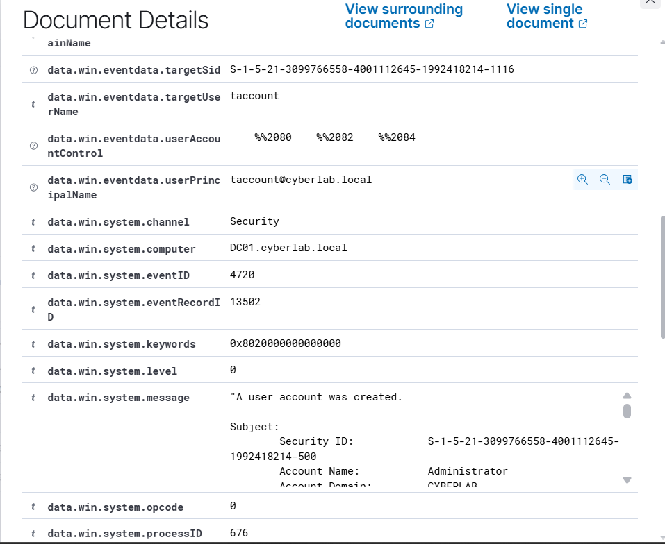
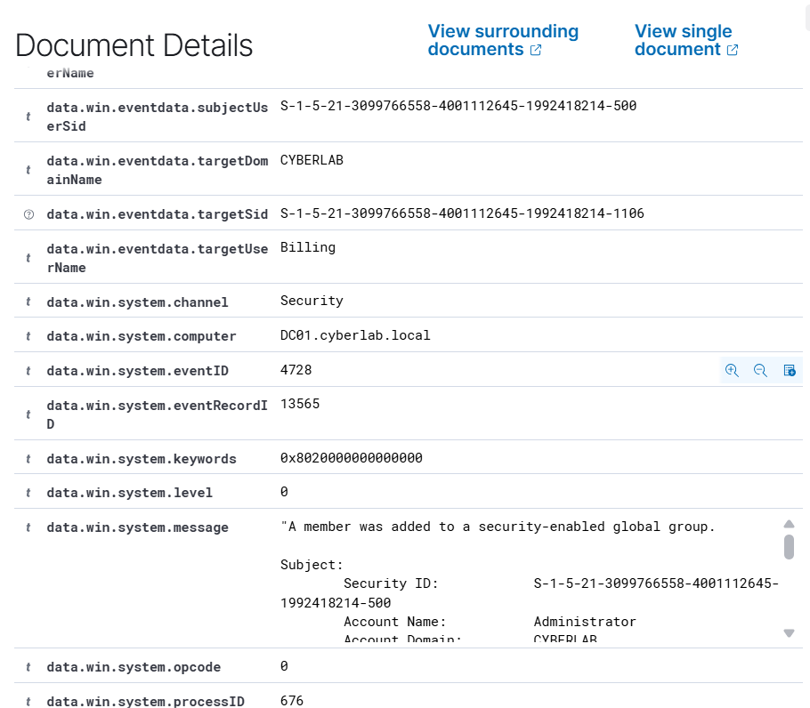
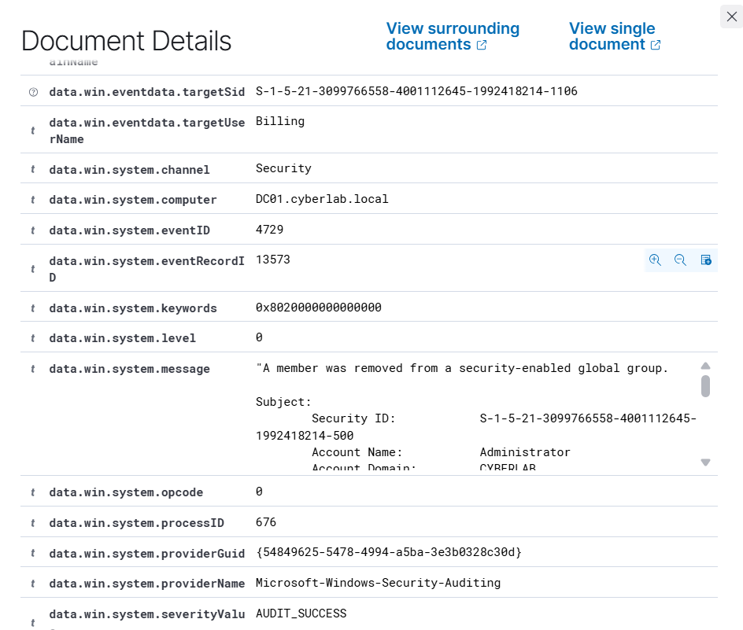
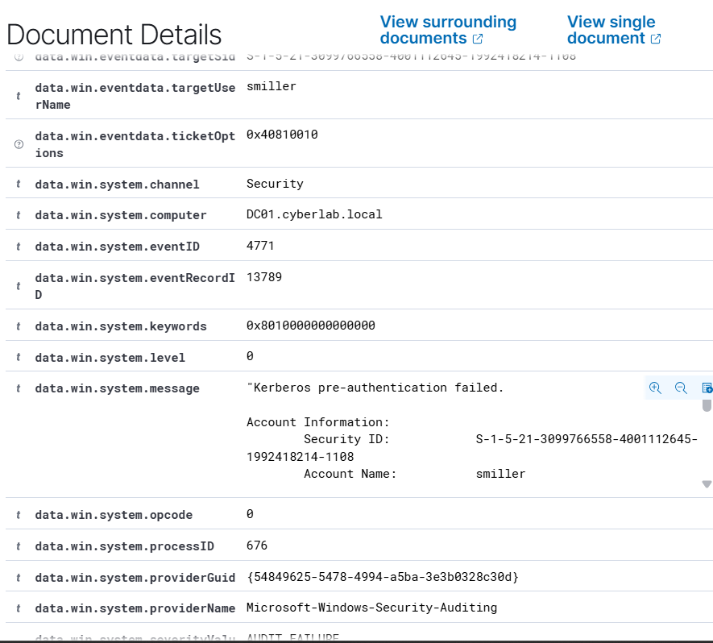
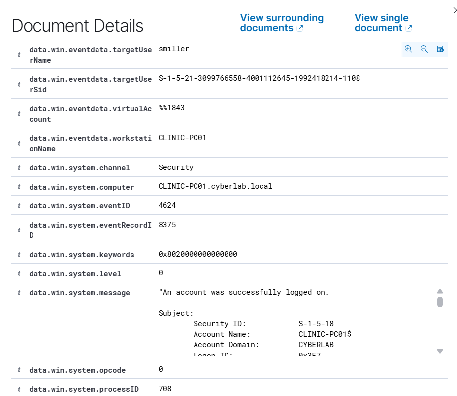
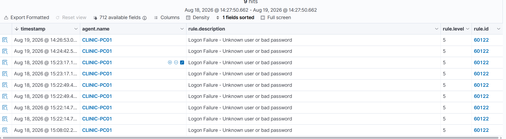

[README.md](https://github.com/user-attachments/files/31441417/README.md)
# Active Directory Security Monitoring with Wazuh

## Objective

Configure centralized monitoring of Active Directory security events using Wazuh.

The goal of this project was to monitor security-relevant activity generated within the `cyberlab.local` domain, with a focus on the domain controller `DC01` and the domain-joined workstation `CLINIC-PC01`.

The project validated monitoring for:

- Domain account creation
- Security group membership changes
- Successful logons
- Failed logons
- Kerberos authentication failures
- Authentication activity across both a workstation and the domain controller

## Environment

- **Domain:** `cyberlab.local`
- **Domain Controller:** `DC01`
- **Domain Controller OS:** Windows Server 2022
- **Monitored Workstation:** `CLINIC-PC01`
- **Workstation OS:** Windows 10 Pro
- **Test User:** `CYBERLAB\smiller`
- **Temporary Test Account:** `taccount`
- **SIEM Server:** `WAZUH01`
- **Wazuh Version:** `4.14.7`
- **Wazuh Server OS:** Ubuntu Server
- **Virtualization Platform:** VMware Workstation

## Architecture

The primary monitoring pipeline used in this project was:

`DC01 → Wazuh Agent → WAZUH01 Manager → Wazuh Indexer → Wazuh Dashboard`

The existing workstation monitoring pipeline was also used for authentication correlation:

`CLINIC-PC01 → Wazuh Agent → WAZUH01`

This allowed activity from both the workstation and domain controller to be investigated centrally through Wazuh.

## Configuration

### Wazuh Agent Deployment

The Wazuh Windows agent was installed on `DC01` and configured to communicate with the Wazuh manager at:

`192.168.26.134`

The agent was enrolled using the name:

`DC01`

After installation, the Wazuh service was started and the endpoint appeared as active in the Wazuh dashboard.

### Domain Controller Audit Policy

The domain controller's Advanced Audit Policy was reviewed using:

```powershell
auditpol /get /category:"Account Logon"
```

Initial auditing showed that **Kerberos Authentication Service** and **Credential Validation** were configured to record successful events only.

To capture failed domain authentication attempts, the applicable Group Policy was updated so the following subcategories recorded both **Success** and **Failure**:

- Audit Kerberos Authentication Service
- Audit Credential Validation

After applying Group Policy, the configuration was verified as:

```text
Kerberos Authentication Service   Success and Failure
Credential Validation             Success and Failure
```

This change allowed the domain controller to generate failed Kerberos authentication events that could then be collected and investigated in Wazuh.

## Account and Group Monitoring

### Event ID 4720 — User Account Created

A temporary Active Directory account named `taccount` was created in the lab environment.

Wazuh successfully captured Windows Security Event ID `4720`.

The event showed:

- **New account:** `taccount`
- **Domain:** `CYBERLAB`
- **Domain controller:** `DC01.cyberlab.local`
- **Account responsible for the change:** `Administrator`

This confirmed that Active Directory user creation activity was being centrally monitored.

### Event ID 4728 — Member Added to Security Group

The test account was added to the `Billing` security-enabled global group.

Wazuh successfully captured Windows Security Event ID `4728`.

The event showed:

- **Target group:** `Billing`
- **Domain:** `CYBERLAB`
- **Domain controller:** `DC01.cyberlab.local`
- **Change performed by:** `Administrator`

This demonstrated visibility into group membership changes that could affect user access and permissions.

### Event ID 4729 — Member Removed from Security Group

The test account was then removed from the `Billing` group.

Wazuh captured Windows Security Event ID `4729`.

The event showed:

- **Target group:** `Billing`
- **Domain controller:** `DC01.cyberlab.local`
- **Change performed by:** `Administrator`
- **Audit result:** `AUDIT_SUCCESS`

Together, Events `4728` and `4729` demonstrated centralized monitoring of security group membership changes.

## Authentication Monitoring

### Event ID 4624 — Successful Logon

A successful domain logon was performed using:

`CYBERLAB\smiller`

Wazuh captured Windows Security Event ID `4624` on `CLINIC-PC01`.

The event identified:

- **User:** `smiller`
- **Workstation:** `CLINIC-PC01`
- **Computer:** `CLINIC-PC01.cyberlab.local`
- **Result:** Successful logon

This provided a baseline example of legitimate authentication activity.

### Failed Logon Detection

An incorrect password was intentionally entered for a domain account on `CLINIC-PC01`.

Wazuh generated a failed-logon detection with:

- **Rule ID:** `60122`
- **Rule Level:** `5`
- **Description:** `Logon Failure - Unknown user or bad password`
- **Agent:** `CLINIC-PC01`

This demonstrated endpoint-side visibility into failed authentication attempts.

### Event ID 4771 — Kerberos Pre-Authentication Failure

Initially, no failed Kerberos authentication event appeared on `DC01`.

Reviewing the domain controller's audit policy showed that **Kerberos Authentication Service** auditing was configured for **Success** only.

After enabling **Failure** auditing through Group Policy, another incorrect domain password attempt was performed.

Wazuh then captured Windows Security Event ID `4771` on `DC01`.

The event showed:

- **Account:** `smiller`
- **Computer:** `DC01.cyberlab.local`
- **Message:** Kerberos pre-authentication failed
- **Security channel:** Windows Security

This confirmed domain-controller-side visibility into failed Kerberos authentication.

## Event Correlation

The same authentication activity produced different evidence depending on where it was observed.

### Successful Authentication

`CLINIC-PC01 → Event 4624 → smiller successfully logged on`

### Failed Authentication — Endpoint Perspective

`CLINIC-PC01 → Wazuh Rule 60122 → Unknown user or bad password`

### Failed Authentication — Domain Controller Perspective

`DC01 → Event 4771 → Kerberos pre-authentication failed for smiller`

This demonstrated how analysts can correlate endpoint and domain-controller telemetry to better understand authentication activity across an Active Directory environment.

## Validation

The following event types were successfully collected and investigated in Wazuh:

- `4624` — Successful logon
- `4720` — User account created
- `4728` — Member added to security-enabled global group
- `4729` — Member removed from security-enabled global group
- `4771` — Kerberos pre-authentication failure
- `Wazuh Rule 60122` — Failed logon caused by an unknown user or incorrect password

These tests validated centralized monitoring of account management, group membership changes, successful authentication, failed authentication, and Kerberos failures.

## Troubleshooting

Failed domain authentication activity was initially visible on `CLINIC-PC01`, but the corresponding failed Kerberos event was not appearing on `DC01`.

The domain controller's audit policy was reviewed using:

```powershell
auditpol /get /category:"Account Logon"
```

The following subcategories were found to be configured for **Success** only:

- Kerberos Authentication Service
- Credential Validation

The applicable Group Policy was modified to enable both **Success** and **Failure** auditing.

The updated policy was then applied using:

```powershell
gpupdate /force
```

After verifying the new audit configuration, another failed authentication attempt was generated.

This time, Windows Security Event ID `4771` appeared on `DC01` and was collected by Wazuh.

This confirmed that the missing telemetry was caused by the Windows audit-policy configuration rather than a Wazuh collection issue.

## Skills Demonstrated

- Active Directory administration
- Windows Server auditing
- Advanced Audit Policy configuration
- Group Policy Management
- Wazuh agent deployment
- SIEM event collection
- Active Directory account monitoring
- Security group membership monitoring
- Windows authentication analysis
- Kerberos authentication analysis
- Event correlation across multiple systems
- Security event troubleshooting
- Windows Event ID analysis
- Detection validation

## Evidence

### Active Directory User Creation



### Security Group Membership Added



### Security Group Membership Removed



### Kerberos Authentication Failure



### Successful Domain Logon



### Failed Logon Detection


